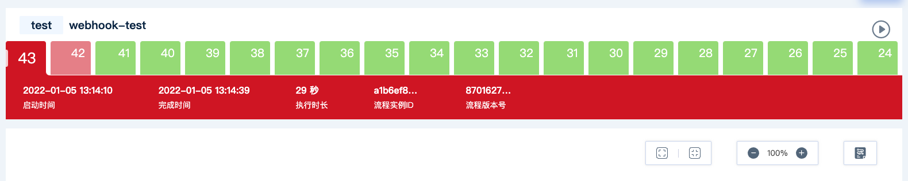
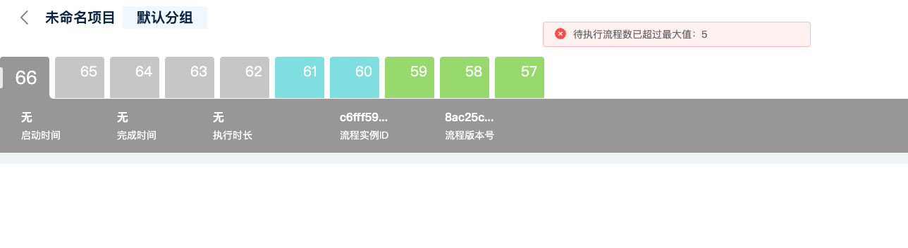

# 自定义安装

本文档将为需要自定义安装的用户提供帮助，如果您只需要快速部署一个可用环境

请参考[快速开始](quick-start.md)章节

## 简要系统架构说明
**v.2.5.0之前：**

由于建木持续集成平台在设计思路上遵循简单性原则，尽量减少用户的部署成本，降低用户的使用与维护门槛。

因此，运行建木需要一个核心的Java后端服务和依赖的Mysql数据库。

另外，由于建木是一个纯粹的前后端分离项目，因此前端需要一个独立的Web服务器来进行部署。

当然，因为建木的任务节点当前都是以容器形式运行在docker上，所以也需要准备一个docker的宿主环境。

**v2.5.0之后：**

自v2.5.0开始，为扩展业务需求，建木CI将内置Worker分离出来了，用户可自行配置Worker。

Worker是必需的，若没有配置Worker，任务将无法执行。

因此，运行建木除了需要一个核心的Java后端服务以及其依赖的Mysql数据库，还需要一个Worker。

另外，由于建木是一个纯粹的前后端分离项目，因此前端需要一个独立的Web服务器来进行部署。

当然，因为建木的任务节点当前都是以容器形式运行在docker上，所以需要为Worker准备一个安装了docker的宿主环境。

具体的架构设计请参考[这里](https://gitee.com/jianmu-dev/jianmu-architecture-as-code)

## 如何从源码编译

建木持续集成平台是一个典型的前后端分离架构，但是为了方便开发部署前后端代码都在同一个代码库中

### 编译工具要求

* Java 11.0.9或更高
* Maven 3.8.1或更高
* NodeJS 16.4或更高
* yarn 1.22.10或更高

**编译Java后端**

```
git clone https://gitee.com/jianmu-dev/jianmu-ci-server.git

cd jianmu-ci-server

mvn package
```

编译打包成功完成后在项目目录下`./api/target`中会存在`jianmu-ci-server.jar`的可执行Fat Jar

**编译Worker Docker**
```
git clone https://gitee.com/jianmu-workers/jianmu-worker-docker.git

cd jianmu-worker-docker

# 若无法下载依赖，可配置代理：go env -w GOPROXY=https://goproxy.cn
go mod download

go build
```
成功后项目目录下的`./jianmu-worker-docker`是编译好的Worker Docker可执行文件

**编译前端代码**

```
cd jianmu-ci-server/ui

yarn install

yarn build
```

成功后项目目录下的`./ui/dist`目录下是编译好的前端文件

## 如何部署

### 前端部署

前端代码可以部署到任意一个支持静态文件的Web服务器下。

可以参考官方镜像使用的部署方式，使用的Web服务器为Nginx

Nginx配置，可参考[nginx-http.conf](https://gitee.com/jianmu-dev/jianmu-ci-server/blob/master/ui/nginx-http.conf)

### 后端部署

**依赖中间件**

Mysql版本需要8.0以上

**服务配置**

由于服务使用Spring Boot开发，因此可以使用环境变量或配置文件进行配置

可用的配置项参考[application.yml](https://gitee.com/jianmu-dev/jianmu-main/blob/master/api/src/main/resources/application.yml)文件

**数据库配置：**

```
SPRING_DATASOURCE_URL: jdbc:mysql://jianmu-mysql:3306/jianmu?useUnicode=true&characterEncoding=utf8&useSSL=false&allowPublicKeyRetrieval=true
SPRING_DATASOURCE_USERNAME: root
SPRING_DATASOURCE_PASSWORD: 123456
```

**平台用户名与密码配置**

```
JIANMU_API_ADMINUSER: admin
JIANMU_API_ADMINPASSWD: 123456
```

**执行记录系统配置**

统一配置所有项目执行记录的显示条数和是否自动清理

> 版本说明：`v2.2.0`开始支持

```
JIANMU_GLOBAL_RECORD_MAX: 20
JIANMU_GLOBAL_RECORD_AUTO-CLEAN: 'true'
```

`JIANMU_GLOBAL_RECORD_MAX`为20，表示项目执行记录只显示最后20条，默认为9999

`JIANMU_GLOBAL_RECORD_AUTO-CLEAN`为true，表示项目启动时，自动删除所有项目最后20条执行记录之前的历史数据；默认为false，表示不自动删除

**触发队列配置**
> 版本说明：`v2.5.0`开始支持
```
JIANMU_TRIGGER-QUEUE-MAX: 5
```

`JIANMU_TRIGGER-QUEUE-MAX`为5，表示串行执行时，排队执行的流程实例最多为5个，超过5个时会报错：


### Worker Docker部署
> 版本说明：`v2.5.0`之后支持独立Worker配置

Worker Docker启动需要定义环境变量，可以自定义一个环境变量文件（如local.env），文件配置如下：
```
JIANMU_SRV_ADDRESS: http://ci-server:8081
JIANMU_SRV_SECRET: worker-secret
JIANMU_WORKER_ID: worker1
```
启动：
```
# 在项目根目录执行该命令，lolcal.env为自定义环境变量文件的路径
./jianmu-worker-docker daemon ./local.env
```