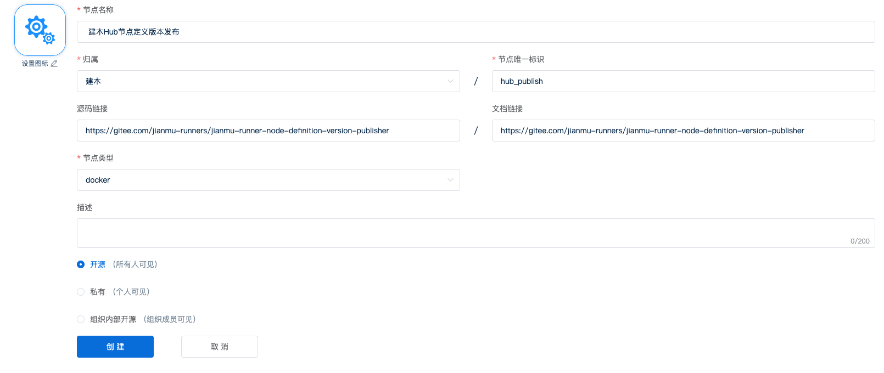
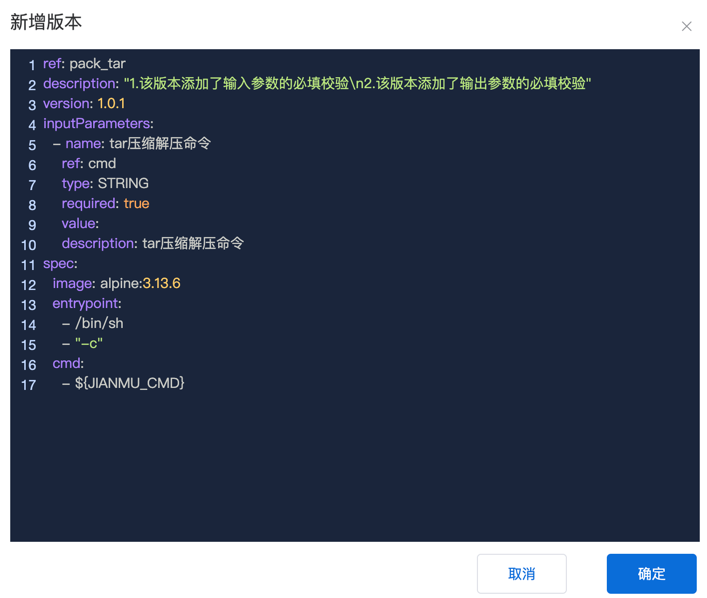

# 自定义节点

当节点库中的节点定义不满足场景需求时，用户可以通过自定义节点满足使用需求。

用户可通过以下步骤创建自定义节点：

1. 创建自定义节点
2. 上传自定义节点到节点库
3. 内置输入参数

### 1. 如何创建自定义节点

用户可以在[建木节点库](https://hub.jianmu.dev)创建节点，来实现节点的自定义。

1. 登录后点击头像进入个人主页，点击创建节点
2. 输入节点信息后点击创建，即创建成功
   

节点定义说明：

```
节点名称: 节点定义名称
归属: 节点所有者，可以选择个人或组织。组织在个人主页进行创建
节点唯一标识: 节点定义在归属内的唯一标识
源码链接: 节点详情界面通过"源码"按钮跳转
文档链接: 节点详情界面通过"文档"按钮跳转
节点类型: 节点类型，当前只支持docker
描述: 节点定义的描述
```

### 2. 如何创建节点定义版本

#### 2.1 通过 Hub 界面创建节点定义版本

1. 点击节点定义名称进入节点定义详情界面
2. 选择所有版本，点击创建版本
3. 输入节点定义版本的 dsl，点击确定，即创建成功
   

节点定义版本 dsl 说明：

| 关键字                            | 说明                                                                                                                                                                                                                                                          |
| --------------------------------- | ------------------------------------------------------------------------------------------------------------------------------------------------------------------------------------------------------------------------------------------------------------- |
| ref                               | 归属人或归属组织的唯一标识/节点定义在归属内的唯一标识，必填，如：jianmu/hub_publish。若为官方节点定义，则可省略归属人或归属组织的唯一标识，如：hub_publish                                                                                                    |
| version                           | 节点定义的版本，必填                                                                                                                                                                                                                                          |
| resultFile                        | 输出参数转换成 json 的文件路径，若定义了输出参数 outputParameters，则必填                                                                                                                                                                                     |
| inputParameters                   | 输入参数列表                                                                                                                                                                                                                                                  |
| inputParameters.ref               | 参数唯一标识，会在容器内转译成'JIANMU\_'开头并大写的环境变量。如：hub_url 在容器内可通过 JIANMU_HUB_URL 环境变量调用，必填                                                                                                                                    |
| <span>inputParameters.name</span> | 参数名称，必填                                                                                                                                                                                                                                                |
| inputParameters.type              | 参数类型，支持 STRING、SECRET、NUMBER、BOOLEAN 等类型，必填。STRING/NUMBER/BOOLEAN: 若参数类型为 STRING/NUMBER/BOOLEAN，可直接填写值或引用其他变量(事件、全局、其他任务的输出等参数)。SECRET: 若参数类型为 SECRET，需要调用平台密钥，具体用法详见密钥管理章节 |
| inputParameters.value             | 参数默认值，若执行该节点定义时，没有指定参数值，将会使用此默认值，必填                                                                                                                                                                                        |
| inputParameters.description       | 参数描述，选填                                                                                                                                                                                                                                                |
| outputParameters                  | 输出参数，需要在"resultFile"指定的文件内填写对应的 json 数据，key 为输出参数的唯一标识（ref）值，格式同输入参数                                                                                                                                               |
| spec                              | 镜像相关信息，节点定义类型为 docker 时，必填                                                                                                                                                                                                                  |
| spec.image                        | 指定该节点定义使用的容器镜像，执行时，平台将会从 dockerhub 拉取指定镜像，必填                                                                                                                                                                                 |
| spec.cmd                          | list 格式，指定容器运行时的 command 内容，选填                                                                                                                                                                                                                |
| spec.entrypoint                   | list 格式，指定容器运行时的 entrypoint 内容，选填                                                                                                                                                                                                             |

节点定义示例:

```
ref: git_clone
version: 1.0.1
resultFile: /usr/resultFile
inputParameters:
  - name: 用户名
    ref: netrc_username
    type: SECRET
    value: ""
    description: git平台的账号
  - name: 密码
    ref: netrc_password
    type: SECRET
    value: ""
    description: git平台的密码
  - name: ssh私钥
    ref: ssh_key
    type: SECRET
    value: ""
    description: 平台中设置的ssh公钥对应的私钥(id_rsa)
  - name: git地址
    ref: remote_url
    type: STRING
    value: ""
    description: 配置远程的git源,即从哪个url上clone项目,使用账号密码的方式的url"https://gitee.com/jianmu_dev/jianmu-ci-ui.git"或者使用ssh的方式的url"git@gitee.com:jianmu_dev/jianmu-ci-ui.git"
  - name: git引擎
    ref: netrc_machine
    type: STRING
    value: ""
    description: gitee.com,github.com,gitlab.com等等
  - name: 标签或分支
    ref: ref
    type: STRING
    value: refs/heads/master
    description: 需要git的标签或者分支,如果是branch则格式为："/refs/heads/master",如果是tag则格式为："/refs/tags/1.0.0"
outputParameters:
  - ref: git_path
    name: git clone目录
    type: STRING
    value: ""
    description: 会将clone完成后的项目存放的地址以绝对路径的方式返回
  - ref: git_branch
    name: git分支
    type: STRING
    value: ""
    description: 如果选择git分支,则会将此分支名返回,如：master,git_tag参数和git_branch参数只会返回一个
  - ref: git_tag
    name: git tags
    type: STRING
    value: ""
    description: 如果选择某个标签,则会将此标签返回,如：1.0.0,git_tag参数和git_branch参数只会返回一个
spec:
  image: 'jianmudev/jianmu-runner-git-clone:1.0.1'
```

相关链接：

1. 节点输出参数：[变量](vars.md)
2. 调用平台密钥：[密钥管理](secrets.md)
3. spe 的其他非必填参数：[spec 参数](https://gitee.com/jianmu-dev/jianmu-ci-server/blob/master/embedded-worker/src/main/java/dev/jianmu/embedded/worker/aggregate/spec/ContainerSpec.java)

#### 2.2. 通过节点库中的`hub_publish`节点创建流程或管道推送该节点定义版本至节点库中

1.流程代码:

```
workflow:
  name: 创建节点定义版本“hub-publish”
  ref: publish_hub_publish_version
  description: 这是一个创建节点定义版本的流程定义样例
  start:
    type: start
    targets:
      - git_clone
  git_clone:
    type: git_clone:1.0.0
    sources:
      - start
    targets:
      - hub_publish
    param:
      ref: refs/heads/master
      remote_url: https://gitee.com/jianmu-runners/jianmu-runner-node-definition-version-publisher.git
      netrc_machine: gitee.com
      netrc_username: ((gitee.username))
      netrc_password: ((gitee.password))
  hub_publish:
    type: hub_publish:1.0.0
    sources:
      - git_clone
    targets:
      - end
    param:
      hub_url: https://api.jianmu.run
      dsl_file_path: /xxx/xxx
      hub_api_key: ((xxx.xxx))
  end:
    type: end
    sources:
      - hub_publish
```

hub_api_key 获取步骤：

1. 登录节点库
2. 点击头像进入个人主页，再点击个人中心
3. 点击 ApiKey 管理，添加 ApiKey
   

2.管道代码；

```
pipeline:
  name: 发布节点定义版本“hub-publish”
  ref: publish_hub_publish_version
  description: 这是一个创建节点定义版本的管道定义样例
  git_clone:
    type: git_clone:1.0.0
    param:
      remote_url: https://gitee.com/jianmu-runners/jianmu-runner-node-definition-version-publisher.git
      ref: refs/heads/master
      netrc_machine: gitee.com
      netrc_username: ((gitee.username))
      netrc_password: ((gitee.password))
  hub_publish:
    type: hub_publish:1.0.0
    param:
      hub_url: https://api.jianmu.run
      dsl_file_path: /xxx/xxx
      hub_api_key: ((xxx.xxx))
```

执行成功后，查看节点定义详情界面，可以看到节点定义版本已经推送成功。


### 3. 内置输入参数

share_dir: 共享目录，容器中可通过 JM_SHARE_DIR 使用
