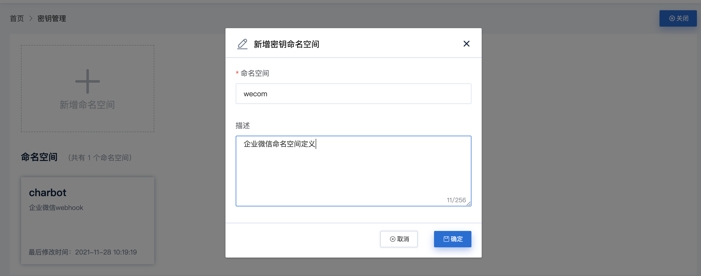
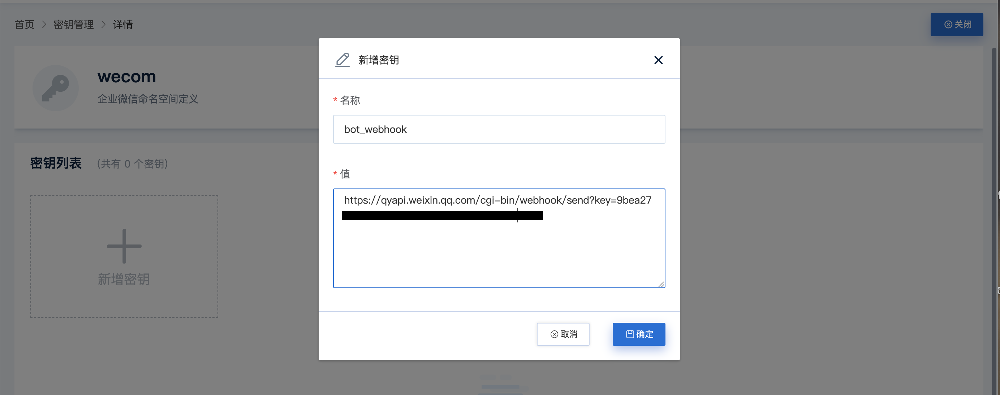
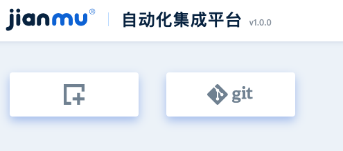

# 快速开始

### 系统要求

推荐使用Ubuntu 21.04系统安装，如[CentOS 7可参考](https://docs.jianmu.dev/guide/centos-install.html)。

Docker 19.30以上，[官方安装手册](https://docs.docker.com/get-started/#download-and-install-docker)

Docker-Compose 1.29.2以上，[官方安装手册](https://docs.docker.com/compose/install/#install-compose)

Kubernetes 1.18以上, [官方安装手册](https://kubernetes.io/docs/tasks/tools/)

### docker-compose部署

**下载`docker-compose.yml`**

```
wget https://gitee.com/jianmu-dev/jianmu-deploy/raw/2.0.0/docker-compose.yml
```

**启动**

```
docker-compose up -d
```

访问[`http://127.0.0.1`](http://127.0.0.1)

默认用户名密码为`admin/123456`

### k8s部署
**下载`kubernetes.yaml`**
```
wget https://gitee.com/jianmu-dev/jianmu-deploy/raw/master/kubernetes.yaml
```

**启动**

```
kubectl apply -f kubernetes.yaml
```

访问[`node节点ip:30180`](http://node节点ip:30180)

默认用户名密码为`admin/123456`

### 创建第一个项目(来自建木的问候)

#### 前提条件说明

* 有企业微信账号
* 新建一个测试群
* 测试群添加一个机器人，并获取机器人的webhook，形如：`https://qyapi.weixin.qq.com/cgi-bin/webhook/send?key=06de918a-fd35-45b7-b2e6-cff28371fd5d`

#### 设置企业微信空间

1. 创建企业微信用户空间，点击秘钥管理，填写命名空间和描述如下：

2. 进入命名空间，创建秘钥，填写名称和值，参考如下


#### 创建并执行第一个项目

1. 创建第一个hello项目

2. 点击git图标，URL输入`https://gitee.com/jianmu-dev/jianmu-docs.git`
3. 填写分支为`2.0.0`
4. 关闭下方的认证开关，点击下一步
5. 选择`hello_world.yml`，点击保存

#### 实现效果

1. 您可以点击项目立即触发执行，届时可以看到测试企业群的Bot就会给你第一个问候。
2. 系统将会根据导入的yaml文件生成名为`hello_world`的流程并在每小时的0/30分时触发执行。